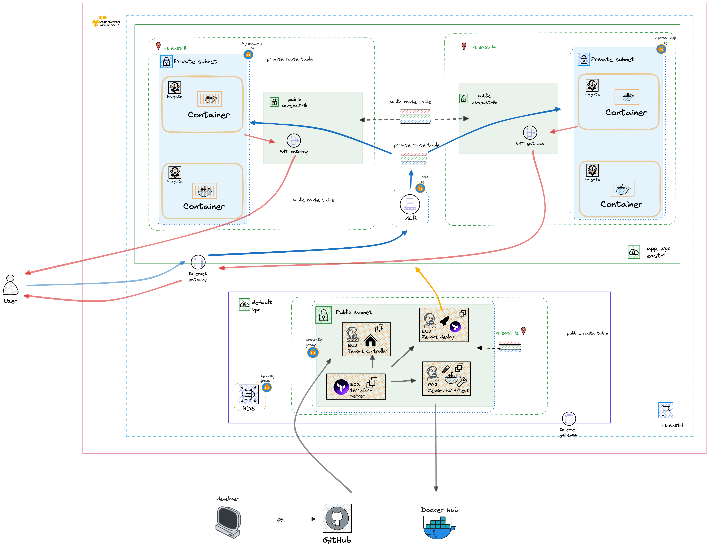

# Elastic Container Service cluster for a containerized Flask application

With the required changes, this repository can be used to deploy an application to an ECS cluster.

This repository contains Terrafrom code for a Jenkins controllers-agent infrastructure. Jenkins runs a pipeline that builds a Docker image for a Flask application, pushes it to Docker Hub, and deploys it to an ECS cluster on a VPC. The VPC and cluster are also created with Terraform. Additionally the deploy stage of the pipeline also creates an application load balancer that forwards traffic to the Fargate instances that host the Flask application. The pipeline is triggered when a push is made to the main branch of the repository.



## VPC for the ECS cluster

The VPC is created by the Terraform code in [/intTerraform/vpc.tf](/intTerraform/vpc.tf) and includes the following resources:

1. 2 Availability Zones, each with a public and private subnet. **Having two availability zones allows for high availability and fault tolerance.**

- **The private subnets host the Fargate instances for the Docker containers with the Flask application**
- The public subnets each serve to route traffic from the internet to the private subnets via the application load balancer

1. Security Group Ports: 8000

- This allows traffic to the private subnets from the application load balancer through the public subnets

3. Security Group Ports: 80

- This allows traffic to the application load balancer from the internet

4. 2 Route Table

- One for the public subnets which allows traffic in from the internet and out to the internet via the internet gateway
- Another for the private subnets which allows traffic in from the public subnets and out to the internet via the NAT gateway

5. 1 NAT Gateway

- The NAT gateway allows the private subnets to access the internet, but no traffic can be initiated from the internet to the private subnets.

## ECS cluster

The ECS cluster is created by the Terraform code in [/intTerraform/main.tf](/intTerraform/main.tf) and includes the following resources:

1. ECS cluster
   - An is a grouping of servers, in this case Fargate instances. The Fargate instances host the Docker containers with the Flask application
   - **The Fargate instances are places in a private subnet and are not accessible from the internet but can access the internet via the NAT gateway. This is a security measure to prevent the Fargate instances from being accessed directly from the internet**
2. ECS task definition
   - The task definition is a blueprint for the Docker container that includes the Docker image, port mappings, and resource requirements
3. ECS service
   - The service is a configuration that tells ECS how many instances of the task definition to run and how to load balance traffic to the instances
   - **This defines the desired number of instances of the task definition to run, if an instance fails it will be replaced to fulfil the desired number of instances**
   - The services includes what load balancer to use
4. Cloudwatch log group
   - The log group stores the logs for the Fargate instances and can be used to set rules and policies for scaling and load balancing

### Changes to main.tf

If you are using another application to this ECS cluster, you'll need to make the following changes to the main.tf file:

1. **Cluster Name**: Replace the placeholder with the name of your ECS cluster.
2. **Task Definition**:
   - **Family**: Use a name to describe the group of servers.
   - **container_definitions**:
     - **name**: Name your container
     - **image**: If you are using Docker Hub,the format is username/image:tag.
     - **containerPort**: Replace the placeholder with the port the container is listening on. This Flask application is served by Gunicorn on port 8000.
   - **execution_role_arn**:
   - **task_role_arn**:
3. **ECS Service**:
   - **name**: Replace the placeholder with the name of your ECS service.
   - **container_name**: Use the name container set in the task definition.
   - **container_port**: This is where your container is listening for traffic

## Application load balancer

The application load balancer is created by the Terraform code in [/intTerraform/alb.tf](/intTerraform/alb.tf) and includes the following resources:

1. Application load balancer
   - The application load balancer forwards traffic to the Fargate instances that host the Docker containers with the Flask application
   - This adds a layer of security to the Fargate instances that host the Docker containers
2. Listener
   - The listener listens for traffic on port 80 and forwards it to the target group
3. Target group
   - The target group is a group of Fargate instances that the application load balancer forwards traffic to

### Changes to alb.tf

1. **Target Group Name**: Use a name to describe the containers that you want to load balance.
   - **port**: This is the port that the application load balancer forwards traffic to and the port that Fargate instances are listening on
2. **Application Load Balancer Name**:
   - Name your load balancer

## GitHub

 Automatic builds and deployments with Jenkins are facilitated by the Github webhook on the Jenkins host server. A POST to the webhook will kick off the pipeline and tell Jenkins to pull the latest code from the repository.

### Github token

The Jenkins pipeline needs a Github token to pull the latest code from the repository. The steps to add the token to Jenkins is in the pipeline section below. These are steps to create the token:

- Navigate to Github users setting
- Click on 'Developer Settings'
- Click on the 'Personal Access Tokens' dropdown and select 'Tokens (classic)'
- Click on the 'Generate new token' dropdown and select 'Generate new token (classic)
- Add an appropriate note like 'Jenkins Controller'
- Full control of the repository is required. Also select admin:repo_hook
- SAVE THE TOKEN, the token will not be displayed again

### Suggested Branch management

The majority of the changes to this repository to configure for a complete deployment of the Jenkins infrastructure and the infrastructure to host the containers can be done through three branches. One branch for Jenkins Infrastructure changes and another for the infrastructure to host the containers. A third for application changes to configure the database connection string.

To create the branches, follow the steps below:

```bash
git checkout -b jenkins-infra
```

After the necessary changes are made. Stage your changes in the local repository:

```bash
git add .
```

To commit the changes to the local repository:

```bash
git commit -m "commit message"
```

To merge the changes to main:

```bash
git switch main
git merge jenkins-infra
```

### Github webhook

  You'll need the public ip of the Jenkins controller to configure the webhook, so you'll need to run the terraform code in [/jenkins-tf](/jenkins-tf/) first, but you'll need to add the token to Jenkins to finish the pipeline setup.

- Once the Jenkins controller is deployed, navigate to the repositories settings in Github
- Click on 'Webhook' and 'Add Webhook'
- Add {jenkins-server-ip:port}/github-webhook/. This comes with the Jenkins Github plugin

### Docker and Docker Hub

The Jenkins pipeline builds a Docker image for the Flask application and pushes it to Docker Hub, this image is then references in the Terraform during the deploy stage. The Docker Hub credentials are added to Jenkins as a secret text credential. The credentials are used to authenticate against Docker Hub when the pipeline pushes the image to Docker Hub.

A Dockerfile is used to build the image. The Dockerfile is in the root of the repository. In a Dockerfile you can specify the base image that includes the runtime for the python application. In this case Python3.7. With Dockerfile specific commands like `COPY`, `RUN`, and `CMD` you can add the application code to the image, install the application dependencies, and specify the command to run the application.

To confirm the Docker image builds and runs locally before pushing it to Docker Hub use the [Dockerfile](dockerfile) is in the root of the repository.

To build the image locally, run the following command from the root of the repository:

```bash
docker build -t {docker-hub-username}/{image-name}:{tag} .
```

To run the image locally, run the following command from the root of the repository:

```bash
docker run -p 8000:8000 {docker-hub-username}/{image-name}:{tag}
```

The application should be accessible at localhost:8000

### Docker Hub credentials

To generate a Docker Hub token, follow the steps below:

- Navigate to Docker Hub
- Click on the profile icon and select 'Account Settings'
- Click on 'Security'
- Click on 'New Access Token'
- Add an appropriate description like 'Jenkins Controller'
- Select 'Read & Write' for the 'Access' dropdown
- Click 'Create'
- SAVE THE TOKEN, the token will not be displayed again

## Jenkins infrastructure and pipeline

**The Jenkins infrastructure** is in a previously created VPC and subnet and is created with the Terraform code in [/Jenkins-tf](/jenkins-tf/)[(instructions for Terraform)](https://github.com/elmorenox/multi-region-banking-app-infrastructure?tab=readme-ov-file#terraform). Three EC2 instances are make up the Jenkins infrastructure.

### Jenkins controller

  The Jenkins controller is the main Jenkins instance that runs the Jenkins pipeline. Below are the steps to configure the Jenkins controller and it's pipeline.

  The ``jenkins-controller-install.sh`` in [/Jenkins-tf](/jenkins-tf/) passed to terraform in the resource block for the EC2 installs Jenkins and it's dependencies. The script also generates an ssh key pair for the jenkins user. The pair is used to authenticate against the Jenkins agents. The public key is added to the authorized_keys file on the Jenkins agents. The private key is added to the Jenkins credential via the Jenkins UI. The private key is used to authenticate against the Jenkins agents.

  To retrieve the public key, login to the jenkins host server and login to the jenkins user that owns the ssh keys and retrieve the public key

```bash
  sudo su - jenkins
  cat .ssh/id_rsa.pub
```

  The public keys needs to be added to the authorized_keys file on the agent server. Open the authorized_keys file on the agent server and paste the public key in the file. The authorized_keys file is located at /home/ubuntu/.ssh/authorized_keys

#### Jenkins pipeline

  A multibranch pipeline is used to build and deploy the . The pipeline is configured to build the application when a push is made to the main branch of the repository.

- Retrieve admin password from /var/jenkins/secrets/initialAdminPassword
- Navigate to {public.ip}:8080 on a browser to configure the dashboard. There will be a prompt to enter the admin password
- Install the recommended plugins

  - From your Jenkins dashboard navigate to Manage Jenkins > Manage Plugins and select the Available tab. Locate this plugin by searching for pipeline-keep-running-step.
- Navigate to 'New Item'
- Select multibranch pipeline
- Name the pipeline
- For "Branch Sources" choose GitHub
- Under the Github section
- Click on 'Add' under the credential drop down, select Jenkins
- Click on the Kind dropdown select 'Username with password'
- Add the Github username that has rights to the respository to the username' field
- In the 'password' field add a GitHub token.
- Click 'Add'. The modal will close.
- Select the credential that were created in the 'Credentials' dropdown
- In the 'Repository HTTPS URL' field add the repositories URL
- Remove all behaviors except 'Discover branches' and select 'all branches'

#### Install the Docker pipeline plugin

  This plugin allows the building of the Docker image. The plugin is installed from the Jenkins dashboard.

- From your Jenkins dashboard navigate to Manage Jenkins > Manage Plugins and select the Available tab. Locate this plugin by searching for Docker Pipeline.
- Click the checkbox next to the Docker Pipeline plugin and install.

#### AWS credentials and Docker Hub credentials

  The pipeline needs AWS credential to create the VPC, application load balancer and ECS cluster. The pipeline also needs Docker Hub credentials to push the Docker image to Docker Hub. To add the credentials to Jenkins follow the steps below:

- Navigate to Jenkins dashboard > Credentials > System > Global credentials > Add Credentials
- Select secret text for the 'Kind' dropdown
- Add a description like 'Docker Hub Credentials'
- Add the Docker Hub token to the 'Secret' field
- Add an ID that matches the ID in the Jenkinsfile. 'docker-hub-credentials'
- Click 'OK'
- Navigate to Jenkins dashboard > Credentials > System > Global credentials > Add Credentials
- Select secret text for the 'Kind' dropdown
- Add a description like 'AWS Credentials'
- Add the AWS access key to the 'Secret' field
- Add an ID that matches the ID in the Jenkinsfile. 'aws-secret-key'
- Click 'OK'

  Repeat this step for the AWS access key.

#### [Jenkinsfile](Jenkinsfile)

The Jenkinsfile needs to be edited to include the Docker Hub username and the Docker image name.
**Edit the Jenkinsfile with your Docker Hub username on line 4**
**Edit the Jenkinsfile on lines 31 and 42 with your image name**

##### Destroy stage

    The destroy stage is used to destroy the infrastructure created by Terraform. The destroy stage is not included in the pipeline by default. To include the destroy stage, uncomment the destroy stage in the Jenkinsfile.

### Jenkins test and build agent

  The agent that runs the tests and builds the Docker image is configured with the ``jenkins-node1-install.sh`` in [/Jenkins-tf](/jenkins-tf/) passed to Terraform in the resource block for the EC2 instance. The script installs Docker as well as Linux and pip dependencies to test the python code and build the Docker image.

### Jenkins deploy agent

  The agent that sets up the VPC for the ECS cluster, and application load balancer is configured with the ``jenkins-node2-install.sh`` in [/Jenkins-tf](/jenkins-tf/) passed to Terraform in the resource block for the EC2 instance. The script installs the Jenkins agent service and Terraform.

### Controller<>Agent communication

  Follow these steps to create the awsDeploy and awsDeploy2 agents and configure them to communicate with the Jenkins controller.

  This steps required the private key for the Jenkins user on the Jenkins controller. The private key is located at /var/lib/jenkins/.ssh/id_rsa.

  In the Jenkins dashboard, navigate to Manage Jenkins > Manage Nodes and Clouds > New Node

  Name the node
  Select 'Permanent Agent'
  Click 'OK'
  In the 'Remote root directory' field add the path to the Jenkins user home directory. '/home/ubuntu/agent1' works.
  In the 'Labels' field add a label. 'awsDeploy'. This to identify the agent se
  In the 'Launch method' dropdown select 'Launch agent via SSH'
  In the 'Host' field add the private ip address of the agent server
  In the 'Credentials' dropdown select 'Jenkins'
  In the 'Username' field add the username of the agent server .e.g. 'ubuntu'
  In the 'Private key' dropdown select 'Enter directly'
  Copy the private key from the Jenkins server and paste it into the 'Private key' field
  Click 'Save'
  Click 'Launch agent'
  Click 'Save'
  Click 'Back to Dashboard' and you'll see your agent running

## MySQL Database in AWS RDS

  In order to shared data across the instances of the application, the application needs a centralized database. The database is created in AWS RDS.

- Navigate to AWS RDS on the AWS console
- Click on 'Create database'
- Select 'MySQL'
- Select 'Free tier'
- Click 'Next'
- In the 'Settings' section:
  - In the 'DB instance identifier' field add a name for the database
  - In the 'Master username' field add a username for the database
  - In the 'Master password' field add a password for the database
  - In the 'Confirm password' field add the password again
  - Click 'Next'
- Select 'Yes" for 'Public access'
- Create a security group with ingress on port 3306. egress can be set to all traffic
- In the Additional configuration section:
  - In the 'Initial database name' field add a name for the database, e.g. 'banking'
- Unselect 'Enable encryption'
- Click 'Create database'
- Find the database in the section 'Databases' and click on the database name
- Retrieve the endpoint from the 'Connectivity & security' section

This endpoint will be used in the application code to connect to the database

## Application Code

In the application code for [app.py](app.py), [database.py](database.py) and [load_data.py](load_data.py) find the ``DATABASE_URL`` constant in each file and replace the connection string with the connection string of the database created in AWS RDS. The connection string is in the format:
[mysql+pymysql://]{username}:{password}@{host}/{database-name}

## Deploy

To deploy the application, push the changes to the main branch of the repository. The pipeline will be triggered and the application will be deployed to the ECS cluster.

```bash
git add . 
git commit -m "commit message"
git push
```

The main.tf output the load balancer's url and you can access the application at that url.


## Destroy

Uncomment the destroy stage in the Jenkinsfile and push the changes to the main branch of the repository. The pipeline will be triggered and the VPC, cluster and application load balancer will be destroyed.

## Issues 

## Improvements